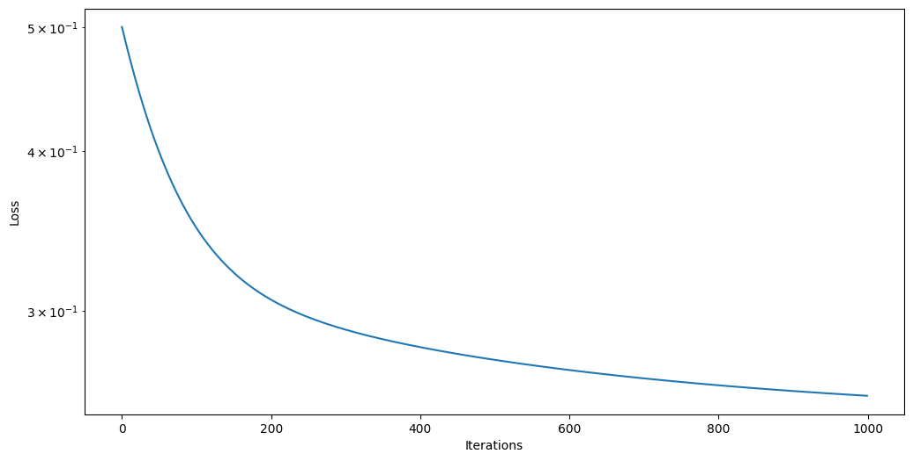
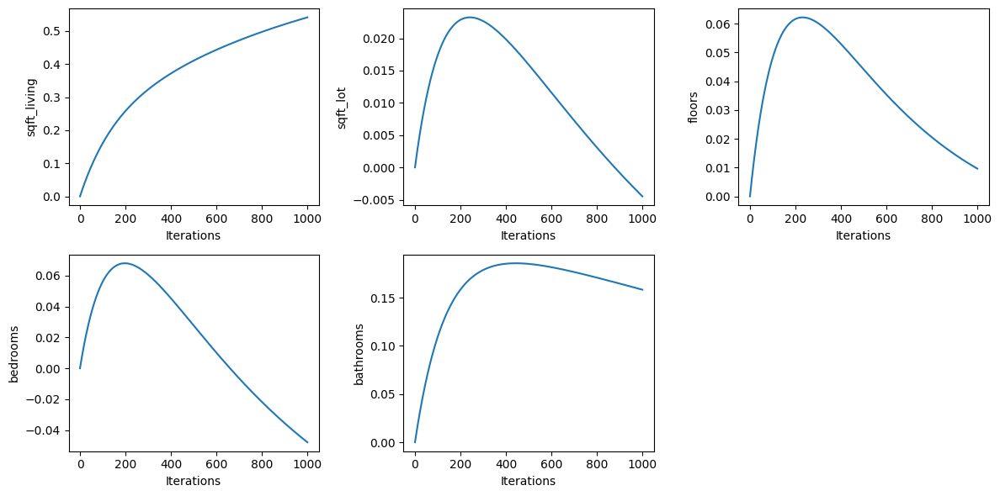

# Linear Regression from Scratch

A multiple linear regression model implemented from scratch in NumPy — no `scikit-learn`, no shortcuts. This project was built to deepen my understanding of vectorization, gradient descent, and NumPy internals, and to practice writing clear technical documentation.

## Overview

The model is trained using batch gradient descent to minimize mean squared error (MSE), with all core operations — the prediction function, loss, and gradients — implemented manually using vectorized NumPy operations rather than explicit loops.

## Repository Structure

| File | Description |
|---|---|
| `house_prices.csv` | Dataset from [hugg](https://huggingface.co/datasets/t22000t/house-prices-tabular) |
| `linearreg.py` | Core library: prediction, loss, gradient computation, gradient descent optimizer, and z-score normalization utilities, each documented with docstrings. |
| `test1.ipynb` | First training run and result visualization (`steps=1e5`, `learning_rate=3e-5`). |
| `test2.ipynb` | Second iteration — *in progress*. |

## Features Implemented

- **Vectorized prediction and cost functions** — no per-sample loops
- **Batch gradient descent** with configurable learning rate and step count
- **Z-score normalization** (with inverse transform) for stable, faster convergence
- **Training diagnostics** — loss and weight trajectories tracked and visualized across iterations

## Example Usage

```python
from linearreg import optimize_parameters, f, zscore_normalize, inverse_transform
import numpy as np

X_train = np.array([[1, 2, 3], [10, 20, 30], [5, 10, 15]])
y_true = np.array([feature1*5 + feature2*1.5 + feature3*(-0.5) for feature1, feature2, feature3 in X_train])

# Normalize features and target
X_norm, X_mean, X_std = zscore_normalize(X_train)
y_norm, y_mean, y_std = zscore_normalize(y_true)

# Train
w, b, J_history, w_history, b_history = optimize_parameters(
    X_norm, y_norm.ravel(),
    w_init=np.zeros(X_norm.shape[1]),
    b_init=0.0,
    steps=100_000,
    alpha=3e-5
)

# Predict
y_norm_pred = f(X_norm, w, b)
y_pred = inverse_transform(y_norm_pred, y_mean, y_std)

print("True:", y_true)
print("Prediction:", y_pred)
```

## Motivation

This project was built as a learning exercise, focused on:
- Understanding gradient descent mechanics beyond the level of a library call
- Practicing NumPy vectorization and array broadcasting
- Building comfort with Matplotlib for training diagnostics
- Writing clear, maintainable documentation

## Status

Actively in progress — `test2.ipynb` extends the initial experiments with further training diagnostics and refinements.

## Result section

test1 trained on `house_prices.csv` with steps=1e5, training_rate=3e-5 and optimized loss function value to approximately 0.2598

**Loss vs Iterations** - Model converges smoothly enough, without big jumpes over local minimum


**Parameters vs Iterations** - The parameters jumps over their local minimun, but eventually riching it, dont really affect training


**Predictions**
```
True value: 350000.0$, Predicted value: 228487$, Difference: 121513$
True value: 480500.0$, Predicted value: 575810$, Difference: 95310$
True value: 465000.0$, Predicted value: 556396$, Difference: 91396$
True value: 530000.0$, Predicted value: 300172$, Difference: 229828$
True value: 485000.0$, Predicted value: 496531$, Difference: 11531$
True value: 575000.0$, Predicted value: 829741$, Difference: 254741$
True value: 550000.0$, Predicted value: 525535$, Difference: 24465$
True value: 706000.0$, Predicted value: 813613$, Difference: 107613$
True value: 585000.0$, Predicted value: 586732$, Difference: 1732$
True value: 350000.0$, Predicted value: 346055$, Difference: 3945$
```


